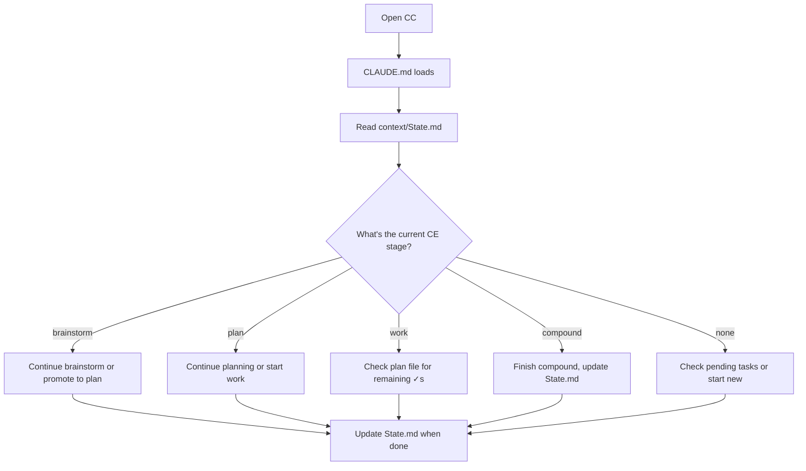
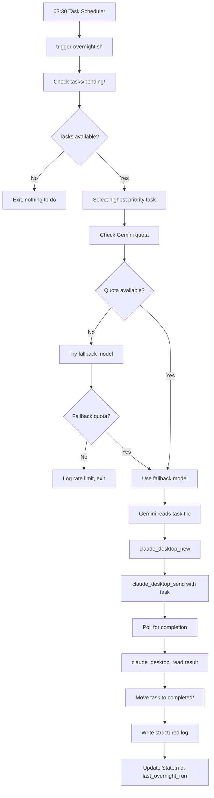
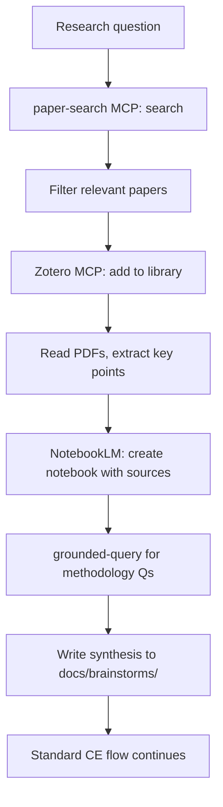

# Unified Workflow Framework Brainstorm

> **Date:** 2026-02-05
> **Status:** In discussion with user
> **Goal:** Define minimal, clean system for CE-grounded work across all interfaces

---

## 1. Complete Tool Inventory

### Execution Interfaces

| Interface | Location | Auto-Context | Can Write State | Can Trigger Others | Best For |
|-----------|----------|--------------|-----------------|-------------------|----------|
| **Claude Code (CC)** | WSL terminal | CLAUDE.md, rules/ | Git commits, filesystem | claude-desktop MCP | Focused coding, CE workflows |
| **Claude Desktop** | Windows app | userMemories only | Chat history (lost on compaction) | N/A (is the target) | Brainstorming, reviews, planning discussions |
| **Gemini CLI** | WSL terminal | GEMINI.md | Filesystem, brain repo | claude-desktop MCP | Overnight orchestration |
| **Antigravity CLI** | WSL terminal | ? | ? | ? | *Needs evaluation* |
| **OpenCode (OC)** | ? | ? | ? | ? | *Needs evaluation - may subsume Gemini* |

### Knowledge/Persistence Layers

| Tool | Location | Sync Method | Agent Writable | Best For |
|------|----------|-------------|----------------|----------|
| **Obsidian (OneVault)** | Windows OneDrive | remotely-save → OneDrive | Via MCP | Personal thinking, daily dumps, iPad access |
| **Obsidian (brain repo)** | Univ OneDrive + GitHub | OneDrive + Git | Via filesystem/git | CE system, task tracking, agent collaboration |
| **Zotero** | Local + Cloud | Zotero sync | Via MCP | Literature management |
| **NotebookLM** | Google Cloud | N/A | Via MCP | Grounded Q&A, source-backed answers |
| **AIM Memory** | ? | ? | Via MCP | Persistent knowledge graphs |

### MCP Servers Available

| MCP | Available In | Purpose |
|-----|--------------|---------|
| claude-desktop | CC, Gemini | Steer Desktop conversations |
| obsidian | Desktop, Gemini | Read/write vault |
| zotero | Desktop, Gemini, CC | Paper management |
| paper-search | Desktop, Gemini, CC | arXiv, PubMed, etc. |
| notebooklm | CC | Grounded queries |
| memory (AIM) | Desktop | Persistent memory |
| github | CC, Desktop | Repo operations |
| context7 | CC | Library docs |

---

## 2. Current Workflows (As-Is)

### Workflow A: Sync Planning Session (Desktop)

```
You open Desktop → cold start → describe task →
Claude spends 10-20 min reading MCPs to build context →
brainstorm/plan → conversation gets long →
compaction may hit → context partially lost →
session ends → decisions live only in chat history →
NEXT SESSION: repeat from scratch
```

**Pain points:**
- No auto-context on start
- No outcome persistence
- Compaction destroys context
- No bridge to execution

### Workflow B: Focused Coding (CC)

```
You open CC → CLAUDE.md loads (partial context) →
may check brain repo state manually →
code with CE plugins → commits go to git →
CE plugin produces docs/plans or docs/solutions →
session ends → CLAUDE.md didn't update →
NEXT SESSION: same stale CLAUDE.md context
```

**Pain points:**
- No awareness of Desktop session outcomes
- session-state.md not updated
- CE loop incomplete (often skip compound step)

### Workflow C: Overnight Autonomous (Gemini→Desktop)

```
Windows Task Scheduler (03:30) →
WSL bash: trigger-overnight.sh →
Python: ccq run --backend desktop →
Gemini CLI (gemini-3-flash-preview) →
claude-desktop MCP → Desktop does work →
task file moved to completed/ → log written →
You wake up → manually check logs →
No structured outcome, no state update
```

**Pain points:**
- Single model (no quota fallback)
- No morning briefing
- No success metrics
- MCP contention if CC also running

### Workflow D: Research Thinking (Obsidian)

```
Open daily note → dump into Today's Focus →
thought mixes with errands, emotions, research →
note saved → never revisited →
same thought reappears 3-5 more times →
eventually discuss with Claude →
that discussion also lost →
methodology decision exists only in memory
```

**Pain points:**
- No atomic capture
- No decision extraction
- No promotion to project state
- Mono-note pattern (arterial_analysis.md = 5007 lines)

---

## 3. The CE Loop (Target State)

```
┌─────────────────────────────────────────────────────────────────┐
│                        CE LOOP                                  │
│                                                                 │
│  ┌──────────┐    ┌──────────┐    ┌──────────┐    ┌──────────┐  │
│  │BRAINSTORM│───►│   PLAN   │───►│   WORK   │───►│ COMPOUND │  │
│  └──────────┘    └──────────┘    └──────────┘    └──────────┘  │
│       │               │               │               │         │
│       ▼               ▼               ▼               ▼         │
│  docs/brainstorms/  docs/plans/   git commits    docs/solutions/│
│  YYYY-MM-DD-*.md   YYYY-MM-DD-*.md  + plan ✓s   YYYY-MM-DD-*.md │
│                                                                 │
└─────────────────────────────────────────────────────────────────┘
```

Each stage produces a **persistent file**. When you return, the file is there.

---

## 4. Proposed Unified Architecture

### Core Principle: Brain Repo = The System

The brain repo is:
- Git-backed (agents can contribute remotely)
- Already has .obsidian/ (can open as vault)
- Already on OneDrive (syncs to devices)
- Already has CE docs/ structure
- Already has task/ queue system

**OneVault stays separate** for personal life notes. Brain repo is the work system.

### Interface Roles (Minimal)

| Interface | Role | When to Use |
|-----------|------|-------------|
| **CC** | Primary executor | CE workflows, coding, any focused work |
| **Desktop** | Brainstorm partner | Thinking sessions, reviews, planning discussions |
| **Gemini** | Overnight orchestrator | Delegated tasks while sleeping |
| **Obsidian (brain)** | Visibility layer | Kanban, dashboards, state viewing on any device |

**Parked for now:** Antigravity, OC, NotebookLM for general use (keep for lit review pipeline specifically)

### State Bridge Pattern

```
┌─────────────────────────────────────────────────────────────────┐
│                     STATE BRIDGE                                │
│                                                                 │
│  ┌──────────────┐                         ┌──────────────┐     │
│  │   Desktop    │──── writes ────────────►│              │     │
│  │   Session    │                         │   State.md   │     │
│  └──────────────┘                         │   in brain   │     │
│                                           │     repo     │     │
│  ┌──────────────┐                         │              │     │
│  │     CC       │──── reads/writes ──────►│  (git-backed)│     │
│  │   Session    │                         │              │     │
│  └──────────────┘                         └──────────────┘     │
│                                                  ▲              │
│  ┌──────────────┐                                │              │
│  │   Gemini     │──── writes ────────────────────┘              │
│  │  Overnight   │                                               │
│  └──────────────┘                                               │
│                                                                 │
└─────────────────────────────────────────────────────────────────┘
```

**State.md contains:**
- Current focus (what am I working on?)
- Active CE stage (brainstorm/plan/work/compound)
- Recent decisions (from last 3 sessions)
- Blocked items (waiting on what?)
- Next actions (what should next session do?)

---

## 5. Flow Diagrams

### Flow 1: Start a New Research Task

```mermaid
flowchart TD
    subgraph Capture["1. Capture (Obsidian or Desktop)"]
        A[Thought emerges] --> B{Where am I?}
        B -->|iPad/phone| C[Quick note in brain vault daily]
        B -->|Desktop| D[Brainstorm with Claude Desktop]
        C --> E[Tag: #to-process]
        D --> F[Desktop writes session-note to brain repo]
    end

    subgraph Process["2. Process (CC)"]
        E --> G[CC reads #to-process notes]
        F --> G
        G --> H[/workflows:brainstorm if unclear]
        H --> I[docs/brainstorms/YYYY-MM-DD-*.md]
        I --> J[/workflows:plan]
        J --> K[docs/plans/YYYY-MM-DD-*.md]
    end

    subgraph Execute["3. Execute (CC or Gemini)"]
        K --> L{Sync or async?}
        L -->|Sync| M[CC executes with OMC ultrawork/ralph]
        L -->|Async| N[Create task file in pending/]
        N --> O[Gemini→Desktop overnight]
        M --> P[Git commits + plan checkboxes ✓]
        O --> P
    end

    subgraph Compound["4. Compound (CC)"]
        P --> Q[/workflows:compound]
        Q --> R[docs/solutions/YYYY-MM-DD-*.md]
        R --> S[Update State.md]
        S --> T[Update CLAUDE.md if systemic]
    end
```

### Flow 2: Resume Work After Break



### Flow 3: Overnight Pipeline



### Flow 4: Lit Review Pipeline (Specialized)



---

## 6. Missing Components (Gap Analysis)

### Critical (Blocks Basic Flow)

| Gap | Impact | Proposed Solution |
|-----|--------|-------------------|
| **State.md doesn't exist** | Every session starts cold | Create State.md with standard schema |
| **Desktop can't write to brain repo** | Brainstorm sessions lost | Desktop writes via github MCP or via session-note convention |
| **No session-note template** | Decisions not captured | Create template with compulsory sections |
| **Kanban not configured** | No visual task pipeline | Set up kanban board in brain repo vault |

### Important (Reduces Friction)

| Gap | Impact | Proposed Solution |
|-----|--------|-------------------|
| **Multi-model quota fallback** | Overnight fails on quota exhaust | Implement in executor.py |
| **Morning briefing** | Have to manually check logs | Add briefing generation to scheduler |
| **Dataview queries** | Dashboard doesn't auto-update | Add dataview to brain vault plugins |
| **CE stage tracking** | Don't know where I am in loop | Add to State.md, update on each stage |

### Nice to Have (Optimization)

| Gap | Impact | Proposed Solution |
|-----|--------|-------------------|
| **OneVault ↔ brain linking** | Can't [[link]] across vaults | Use text references or merge vaults |
| **iPad kanban editing** | View-only on mobile | Test if kanban plugin works on mobile |
| **Antigravity/OC evaluation** | May have better orchestration | Defer until core loop works |

---

## 7. Proposed File Structure

```
brain/
├── CLAUDE.md                    # CC entry point (existing)
├── context/
│   ├── State.md                 # NEW: Current state bridge
│   ├── priorities.md            # Existing (needs update)
│   └── ...
├── docs/
│   ├── brainstorms/             # CE brainstorm output
│   ├── plans/                   # CE plan output
│   └── solutions/               # CE compound output
├── tasks/
│   ├── pending/                 # Task queue
│   ├── active/                  # Currently running
│   ├── completed/               # Done
│   └── failed/                  # Failed (for retry)
├── sessions/                    # NEW: Session notes from any interface
│   └── YYYY-MM-DD-HHMMSS-<interface>-<topic>.md
├── dashboards/                  # NEW: Obsidian views
│   ├── BOARD.md                 # Kanban board
│   ├── CE-Pipeline.md           # CE stage dashboard
│   └── Overnight-Status.md      # Scheduler status
└── .obsidian/                   # Already exists
    └── (needs: kanban, dataview plugins)
```

---

## 8. State.md Schema (Proposed)

```yaml
---
updated: 2026-02-05T22:00:00Z
updated_by: claude-desktop
---

# Current State

## Focus
- **Active project:** cardiac-output-estimation
- **CE stage:** plan
- **Plan file:** docs/plans/2026-02-05-cardiac-output-cv-analysis-plan.md

## Recent Decisions
1. Use nested CV for validation (2026-02-05, Desktop session)
2. Start with arterial_analysis code review before new code (2026-02-05)
3. Feature selection: defer to after baseline model (2026-02-05)

## Blocked
- [ ] Arterial analysis code review (need to find repo location)

## Next Actions
- [ ] Review arterial_analysis codebase structure
- [ ] Continue cardiac output plan (validation methods section)

## Last Sessions
| Date | Interface | Topic | Outcome |
|------|-----------|-------|---------|
| 2026-02-05 22:00 | Desktop | Workflow framework | This brainstorm |
| 2026-02-05 14:00 | CC | Scheduler fixes | Multi-model fallback WIP |
```

---

## 9. Session Note Template (Proposed)

```markdown
---
date: {{date}}
interface: desktop|cc|gemini
project:
ce_stage: brainstorm|plan|work|compound|review
---

# Session: {{topic}}

## Context
What was I trying to do?

## Key Discussion Points
-

## Decisions Made
1. **Decision:**
   **Rationale:**
   **Confidence:** high|medium|low

## Questions Raised
- [ ]

## Next Actions
- [ ]

## Compounds To (if work session)
Link to docs/solutions/ file if applicable
```

---

## 10. Open Questions for User

1. **Vault merge vs separate:** The Desktop session research showed 70-80% of Obsidian users prefer single vault. Do you want to try merging brain repo into OneVault (with .gitignore for personal stuff), or keep them separate with explicit State.md bridge?

2. **Session notes location:** Should session notes live in `brain/sessions/` (agent-accessible) or `OneVault/sessions/` (personal-accessible)? Or both with a sync rule?

3. **Daily note role:** Should your Obsidian daily note be:
   - (a) Just links to session notes (thin index)
   - (b) Quick capture that gets processed into session notes
   - (c) Deprecated entirely in favor of session notes

4. **Overnight priority:** Is fixing the overnight pipeline (multi-model, briefing) more important than the session persistence problem, or vice versa?

5. **Lit review pipeline:** Should this be a separate documented flow, or integrated into the main CE loop with special tools?

---

## 11. Recommended Next Steps (If Approved)

1. **Create State.md** in brain repo with initial state
2. **Create session-note template**
3. **Configure kanban + dataview** in brain repo vault
4. **Write Desktop→brain-repo bridge convention** (how Desktop sessions write to git)
5. **Update CLAUDE.md** to read State.md on start
6. **Test the loop** with one real task (arterial code review or cardiac planning)

---

*This document is for discussion. No implementation until we agree on architecture.*
